### 2011

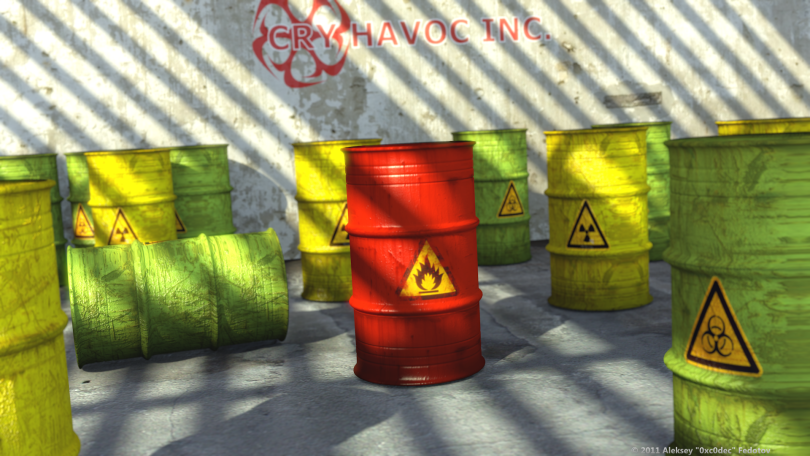

Render size: 1080p, software: Blender, GIMP, Inkscape

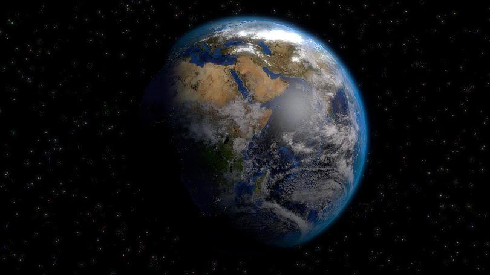

Render size: 1080p, software: Blender

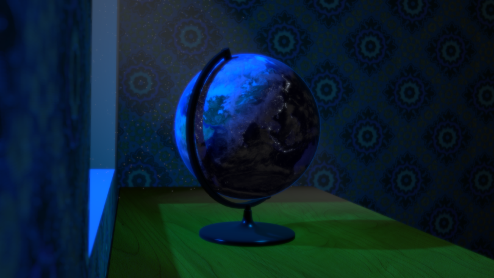

Render size: 720p, software: Blender

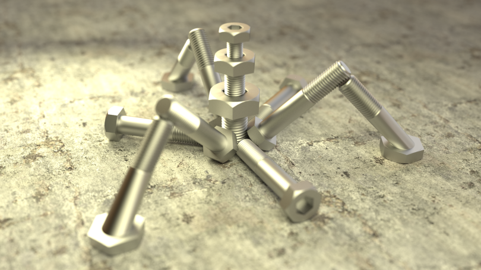

Render size: 1080p, software: Blender Cycles

### 2010

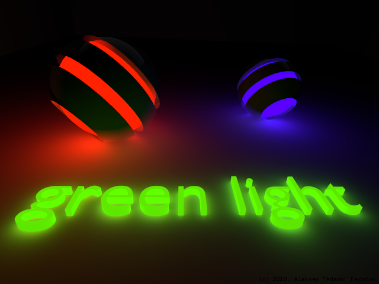

### 2009

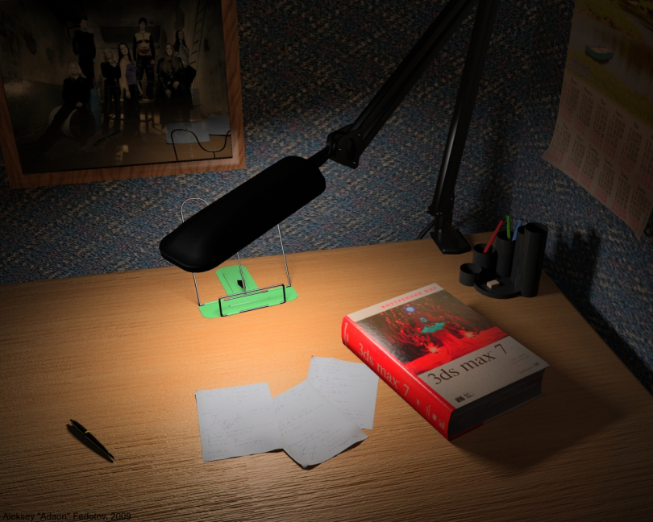

### 2006

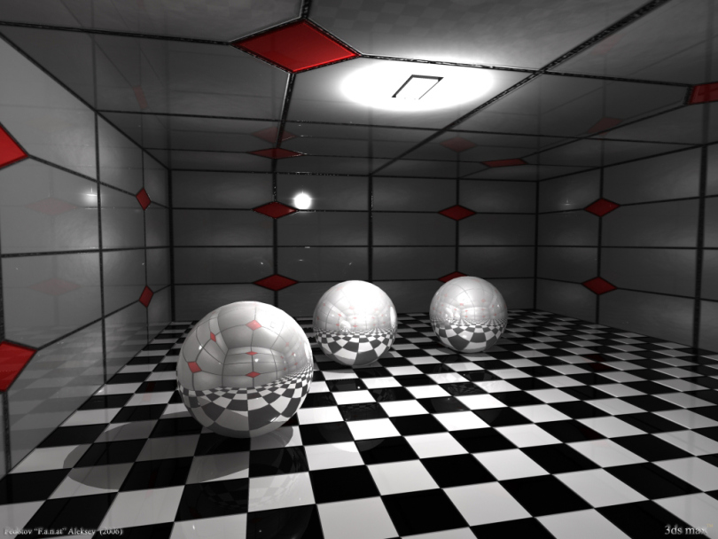

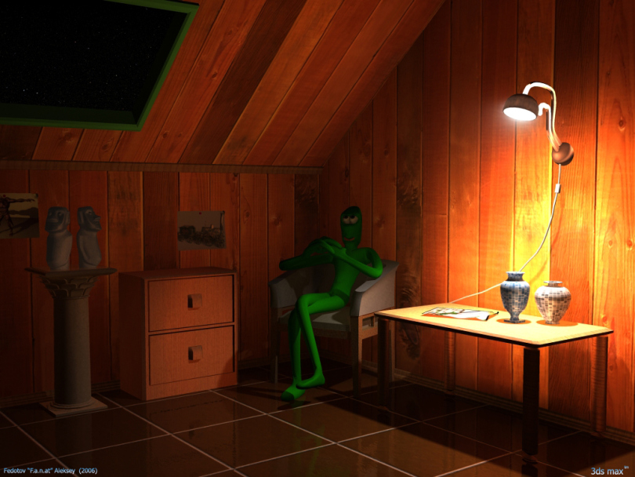

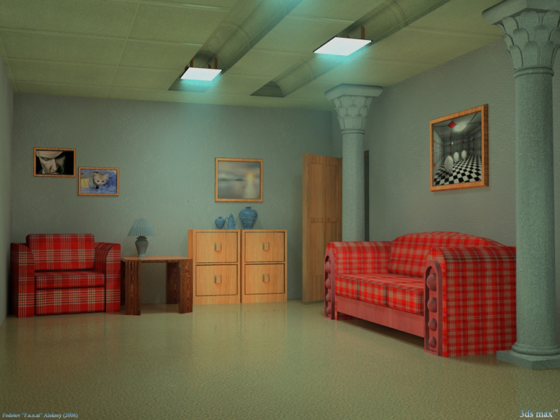

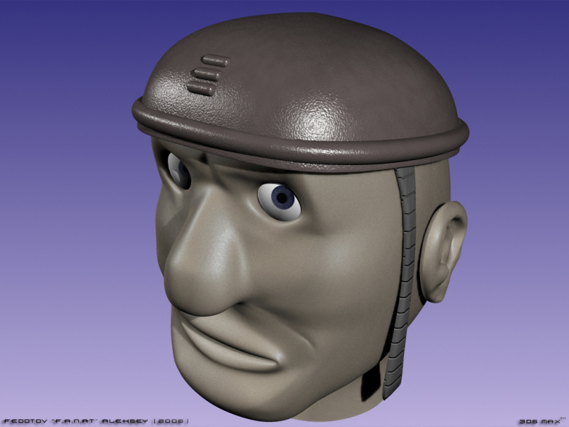

### 2005

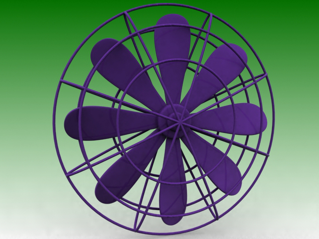

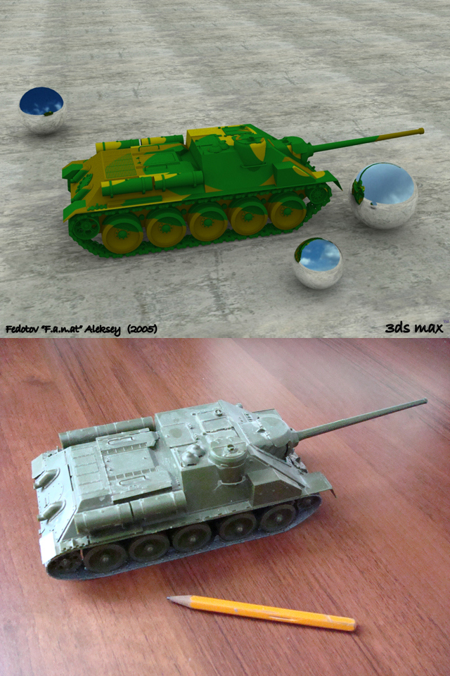

