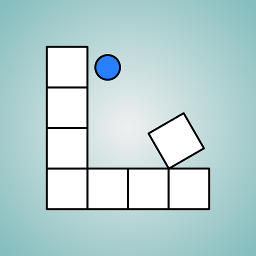
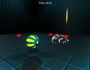

Below is the list of some games that I've created in my spare time.

<h3><a href="/nsf/">Not So Flat</a></h3>

	

		

			
		

	

	

		
	

<h3><a href="/rebus/">Ре:бусы</a></h3>

	

		

			
		

	

	

		
	

<h3><a href="/cubicroll/">Cubic Roll</a></h3>

	

		

			
		

	

	

		
	

<h3><a href="/line-bound/">Line Bound</a></h3>

	

		

			
		

	

	

		
	

<h3><a href="/uncopy/">Uncopy</a></h3>

	

		

			
		

	

	

		
	

<h3><a target="_blank" href="http://www.ludumdare.com/compo/ludum-dare-27/?action=preview&uid=20100">Test Chambers (for Ludum Dare 27)</a></h3>

	

		

			
		

	

	

		My competition entry for the Ludum Dare 27, which was held at 23-26 august, 2013. The theme was "10 seconds".
	

<h3><a href="/2013/05/22/nether-devblog-intro.html">Project Nether (abandoned)</a></h3>

	

		

			
		

	

	

		There's only a blog post left that reminds of that game. And a long-forgotten Git repository somewhere.
	

<h3><a href="/yarc/">Yet Another Rubik's Cube</a></h3>

	

		

			
		

	

	

		
	

