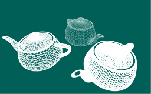
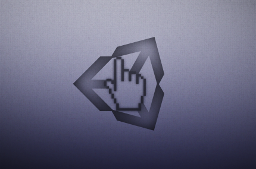

Below is the list of some software projects that I've created in my spare time.

<h3><a href="/solo/">Solo Engine</a></h3>

	
No logo

	

		A C++ game engine that I write in my spare time. The main purpose of it is to learn technologies, master software architecture design and to implement an engine that I think is the most convinient to use.
	

<h3><a href="/wireframe/">Wireframe</a></h3>

	

		

			
		

	

	

		
	

<h3><a href="/hwcursor/">Unity3d hardware cursor</a></h3>

	

		

			
		

	

	

		
	

<h3><a target="_blank" href="https://github.com/0xc0dec/ustats/wiki">UStats module for Nginx</a></h3>

	

		

			
		

	

	

		The module provides basic statistics for nginx upstream servers: the number of requests passed to them,
		the number of errors of different kinds, and so on.
	

<h3>Other</h3>

	<ul>
		<li><a target="_blank" href="http://code.google.com/p/nginx-patches/wiki/HeadersFilterModulePatch">NGINX HeadersFilterModule patch</a></li>
		<li><a target="_blank" href="https://github.com/0xc0dec">More on Github...</a></li>
	</ul>

