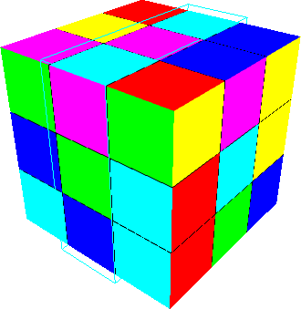

	

	

		

		
		

		

			Keyboard controls:

			<ul>
				<li>Cursor keys - move virtual cursor across the cube</li>
				<li>Ctrl/Alt - rotate cube fragment</li>
				<li>Shift + cursor keys - rotate cube</li>
				<li>M - menu</li>
			</ul>
		

		

			The game is available with sources for Windows and Linux. <a target="_blank" href="http://code.google.com/p/yetanotherrubikscube/">View on GoogleCode</a>.
		

	

